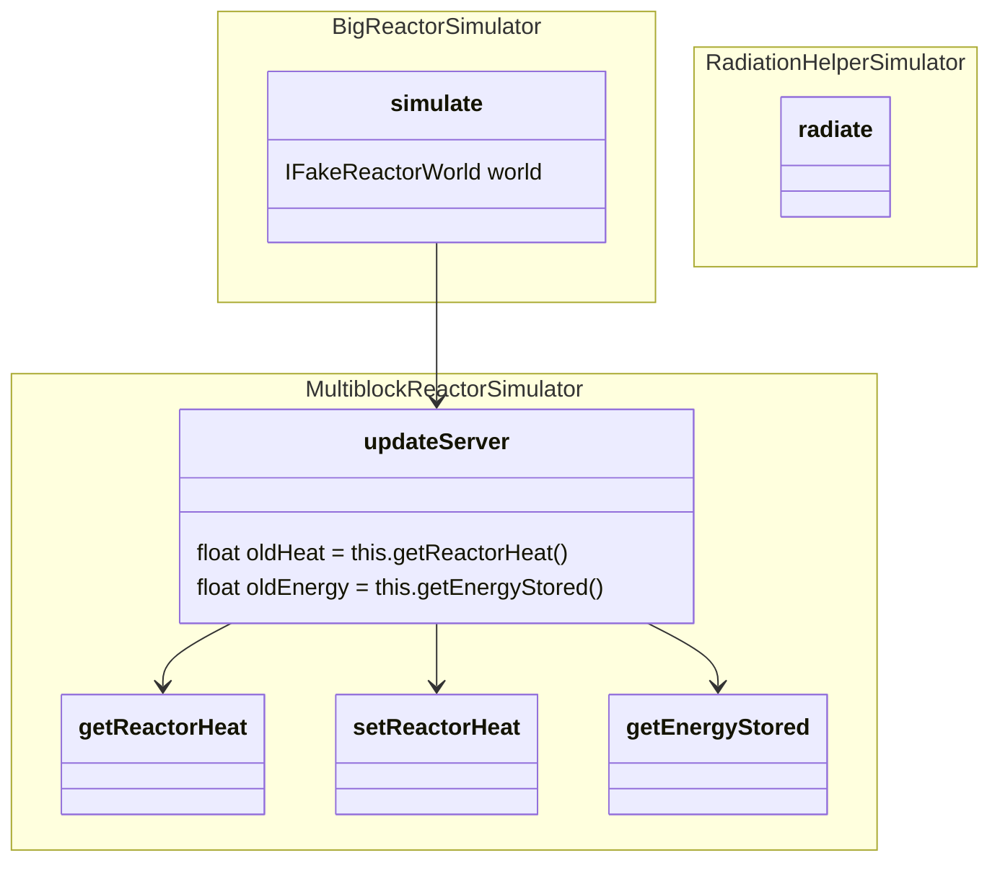

```mermaid
classDiagram
namespace BigReactorSimulator {
	class simulate {
		IFakeReactorWorld world
		
	}
}

namespace RadiationHelperSimulator {
	class radiate {
		
	}
}

namespace MultiblockReactorSimulator {
	class updateServer {
		float oldHeat = this.getReactorHeat()
		float oldEnergy = this.getEnergyStored()
		
	}
	class getReactorHeat
	class setReactorHeat
	class getEnergyStored
}

simulate --> updateServer
updateServer --> getReactorHeat
updateServer --> setReactorHeat
updateServer --> getEnergyStored
```